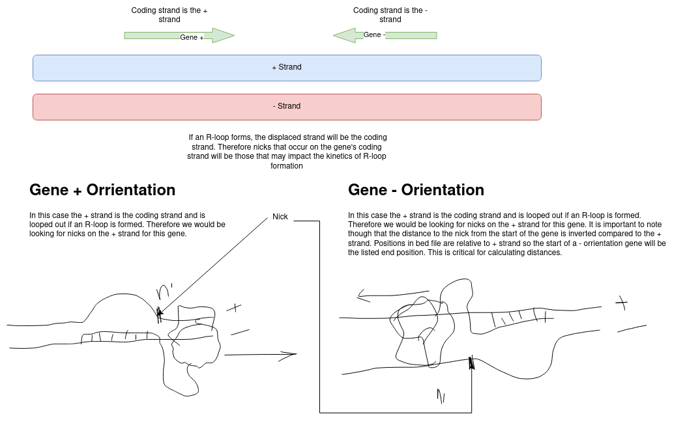
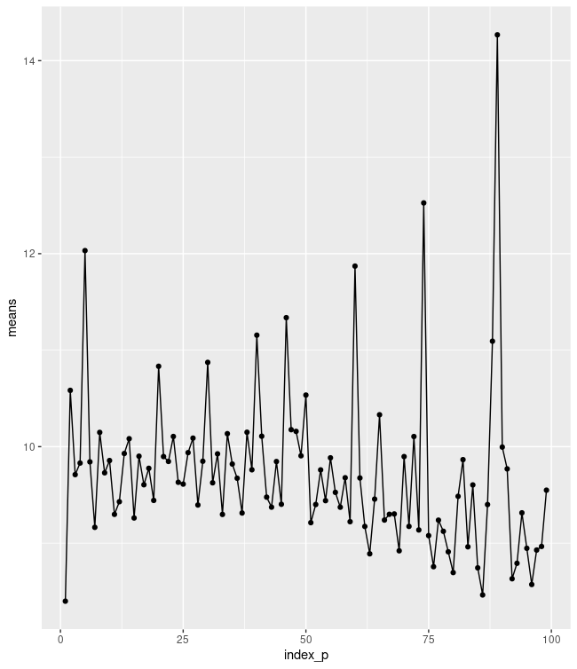
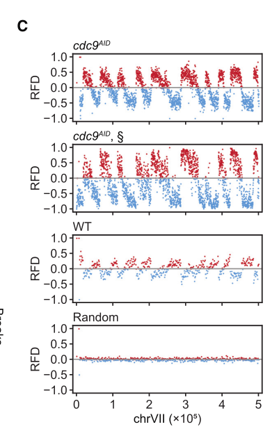

# New notes format

At lab meeting yesterday Fred talked about the format that he would follow in
his lab notebook and it generally was experiment organized and started with
the question that was being asked and each entry ended with a summary of what
was / was not learned. So going forward I am going to try and use this format
for daily computational notes.

# Question

What is the distribution of SSB signal in and around genes; how does this
distribution change when calling for Okazaki fragment enrichment or depletion?
How do both of these distributions compare to global R-loop formation (DRIP)
signal?

# Approach

Create gene metaplots to visualize signals globally.

## Gene coordinates

Gene coordinates are coming from file provided by Stella located at
`/home/mitochi/Work/data/bed/hg19_apprisplus.bed` at time of writing.

```
chr1    29554   31097   APPRIS1;ENST00000473358;MIR1302-11      0       +
chr1    34554   36081   APPRIS2;ENST00000417324;FAM138A 0       -
chr1    69091   70008   APPRIS3;ENST00000335137;OR4F5   0       +
chr1    89551   91105   APPRIS4;ENST00000495576;RP11-34P13.8    0       -
chr1    92230   129217  APPRIS5;ENST00000477740;RP11-34P13.7    0       -
chr1    134901  139379  APPRIS6;ENST00000423372;AL627309.1      0       -
chr1    139790  140339  APPRIS7;ENST00000493797;RP11-34P13.14   0       -
chr1    146386  173862  APPRIS8;ENST00000466557;RP11-34P13.13   0       -
chr1    160446  161525  APPRIS9;ENST00000496488;RP11-34P13.9    0       +
chr1    236112  267253  APPRIS10;ENST00000424587;AP006222.2     0       -
```
## Translating coordinates into gene percentages

Want to create a file that would be amenable to bedtools intersect function
with whatever peaks that we are interested in looking at. One approach would
be to just intersect the coordinates file with peaks, require strandedness,
and then process the intersected file. 

Another method would be to break up the file into n% chunks of each gene first
then intersect. Problem would then be you would lose parts of the file that
do not intersect with anything. That would actually still be true when
using the first method so would need to make sure we preserve all genes.

Either way I want the final output to be a bed file (meta bed) that has
gene name and everything but the coordinates will no longer map to a genomic
position and instead be the percentage of gene body (or whatever region
looking at) and score was the signal in that region. 

### A note on gene vs. nick orientation 




## Initial results

After working and debugging metaplot code today, almost to creating actual
plots. Almost all the infrastructure is now setup. Main change I need to make
is finding a good way to plot the mean scores at each percentage position of
the gene body. Including error bars isn't difficult but it would be nice to
have the error bars be shown in the same way confidence iterval is for
`geom_smooth`.

Either way, below is a plot looking at calling breaks normally and just plotting
the means at each position in the genome. 



This should emphasize breaks due to Okazaki fragments. The plot is almost
sinusoidal in appearance with building amplitude as you move further down
the gene body. Also note we are only seeing forward strand genes.

At first to me this almost looked like figure 4 part C from the GLOE-seq
paper (shown below).



`RFD (RFD = [REV – FWD]/[REV + FWD])`

But this is not selecting for genes and just showing across the entire
chromosome so I am a little unsure what is going on with my plot and if
it way be due to a bug in the pipeline somewhere.

I think it would be a good idea to try and replicate this strand
bias type plot as a sanity check and to compare to the reverse call
data to see if the strand bias is depleted by the reverse peak calling.

# Summary

Today I began to address if Okazaki fragment free SSB data are showing bias towards particular regions of the gene. I found from initially
plotting Okazaki enriched data the mean of signal across all genes
in 1% intervals was almost sinusodial in nature. Further work needs
to be done in order to tease out the presence of any bias.

## Todo

- Combine + and - strand metaplots
- Increase metaplot resolution (adding more bins) possiblely increase to 1k
- Replicate Figure 4C and see if reverse peak calling eliminates any
  observed patterns.

