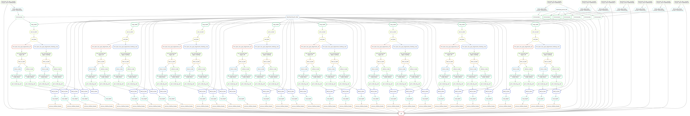

# Feeling the flow

Working more on the workflow today. Figured out how to run comparison
rules only for replicates, which was easier than I was making it out to be. This
just involved creating a list of tuples representing the paired samples (replicates)
and expanding these in the rule all. 

## R environment

Crick doesn't seem to have R 4.0 which was a problem in the GLOE-loops
repo and at the time of writing I had to hard code filepaths to the R
version used in the base conda env. Here I am trying to create a
distinct R env in order to avoid that. 

## Regions of comparison

Add rules to Snakemake file to limit comparisons to only footprinted regions.
This will be much faster and take less memory but does not consider whole
genome of course. These files have `footloop` extension in them.

## Current workflow

