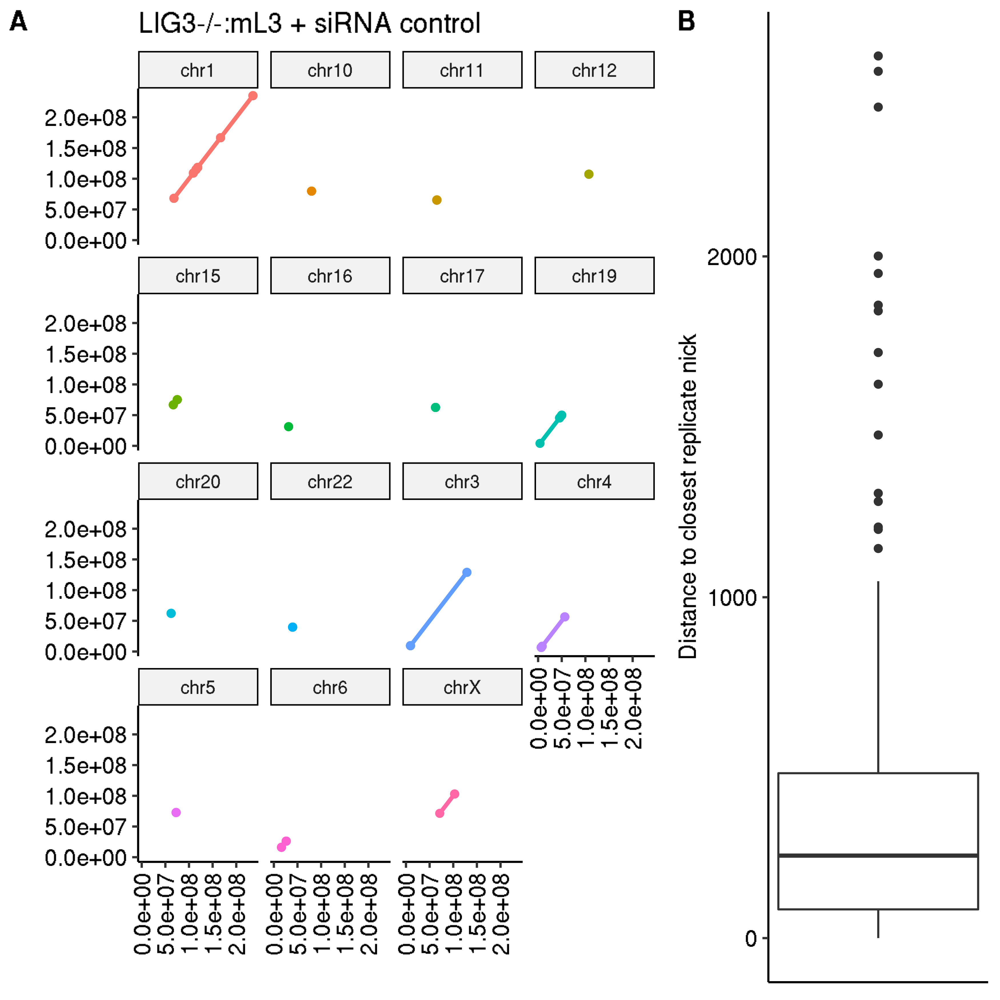
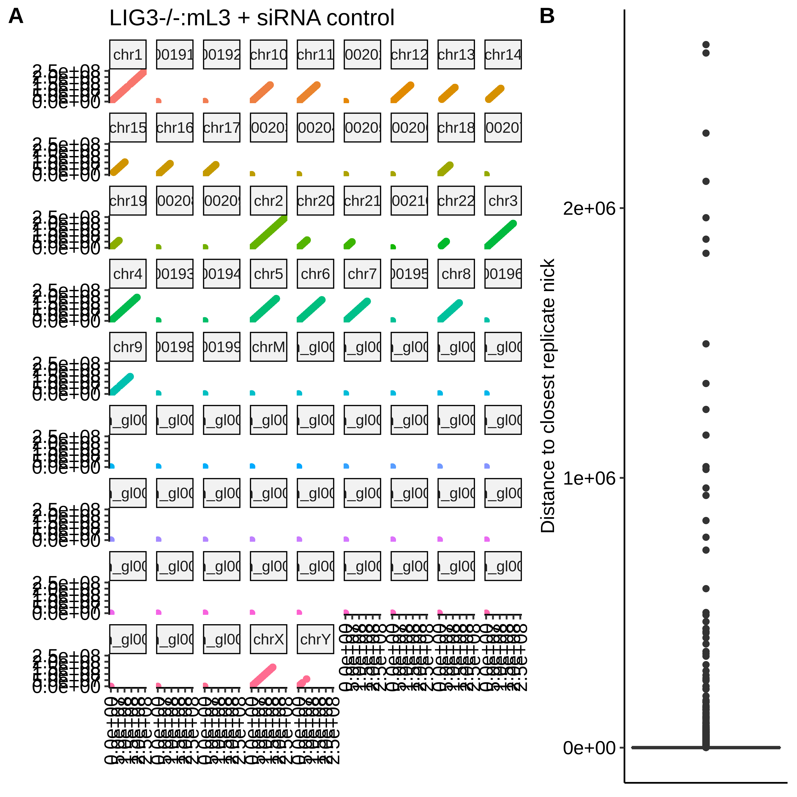

# Making plots

## Initial thoughts

Have been doing a lot of debugging related to plotting but have
gotten to the point where almost able to compare mean distances between 
trimmed nicks (signal >= mean - sd).

Draft plots look like the one below, which is only looking at nick distances
for footloop regions for the forward strand.

This is showing there are not many nicks directly within footloop regions
and on average distance to closest replicate nicks is around ~200 bp.

It would probably be helpful to add a control line to the scatterplot which
is plotting replicate 1 nick start sites vs replicate 2 nick start sites.

If matched perfectly slope of line = 1.

Still running the results for all regions of the genome which should be
more representative of the overall match between replicates.

First round of plotting all sites came out like this

Scaffolds are being plotted at the huge max distance between breaks in some
cases is really skewing the boxplot. Going to have to filter for
non-scaffold chromosomes and possibly limit range of boxplot in some way