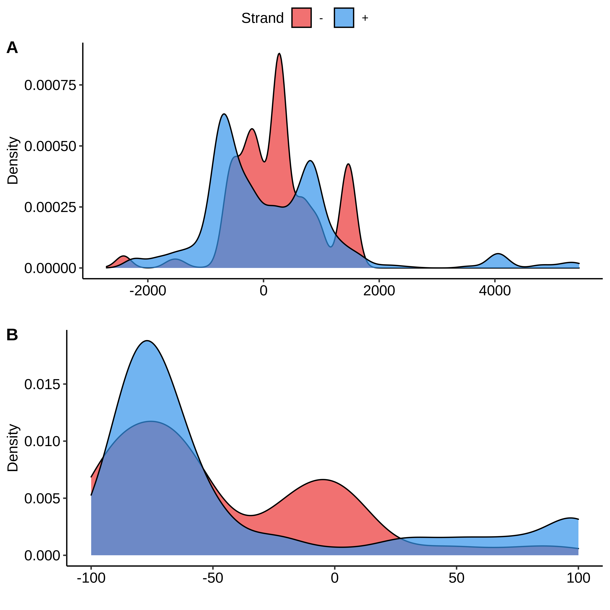
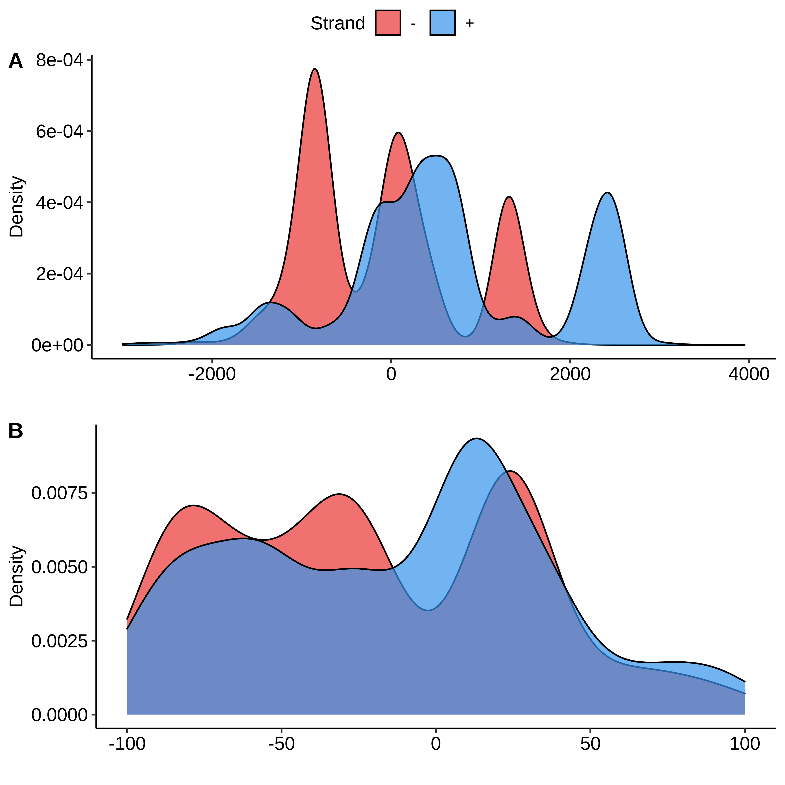

# Attempting to remove "noise" of Okazaki Fragments

The GLOE-seq paper focused on the analysis of Okazaki fragments and their
ability to map these fragments as compared to other previous methods. I am
currently interested in the "spontaneous" breaks they detected and their
association to R-loops. 

In their pipeline they use `macs2` to call beaks between test and control
samples. Notably there is a human cell line with Ligase-1 knocked out via
siRNA silencing. Ligase-1 is responsible for sealing the nicks between
Okazaki fragments and therefore comparing to a control cell line should
reveal positions of Okazaki fragments. 

In my case we actually want to throw out these fragments and retain the
non-Okazaki reads. This would in theory leave SSBs that are not a result of
DNA replication and include spontaneous breaks which would be more appropriate to
look at in relation to R-loop formation sites.  

## Strategy

My approach here was to do break calling using Macs2 using parameters lifted
from the [GLOE-Pipe program](https://gitlab.com/GPetrosino/GLOE-Pipe/-/blob/master/modules/GLOEseq/macs2.module.groovy)
and then use `bedtools intersect -v` to remove called breaks from the treatment
sample. 

This would leave a bed file for the treatment sample devoid of breaks that
were called due to the differences with the control after treatment with
ligase-1. 

## Initial results / thoughts


`output/GSM4305466/reorient_alignments/direct/rev/seperated.all.bed`
, the output from mapping reads without calling peaks yet, was intersected with 
`output/call_peaks/GSM4305466.vs.GSM3939125_macs2/direct/all/rev/macs2_peak_call_summits.bed`
which was the output of calling peaks using sample `GSM4305466` (ligase 1 treated)
with the control `GSM3939125` (no treatment). This intersection only preserved
the reads in `output/GSM4305466/reorient_alignments/direct/rev/seperated.all.bed`
that *did not* overlap with reads in 
`output/call_peaks/GSM4305466.vs.GSM3939125_macs2/direct/all/rev/macs2_peak_call_summits.bed`. In other words, the result of this operation
should have removed all the SSBs in the treatment that were called due
to differences to the control.

### Examining the files

`cat output/GSM4305466/reorient_alignments/direct/rev/seperated.all.bed | wc -l`
reveals the file to have a total of 104,783,006 lines (reads).
The MACS2 summits file has 1,074,860 lines. The intersected file
contains 71,698,663. 

This means ~30,000,000 reads where removed from the original mapped
reads but left the vast majority. This is only for one sample
and for one strand but I was expecting this drop to be *much* larger
than that. Possibly around > 60% of the reads as the present result would
seem to indicate that most of these breaks are not in fact Okazaki
fragments. 

This needs some further investigation and visualization which I am
working on further today. Maybe with some kind of flow diagram?

Also need to correct the spelling of 'seperated'.

### Thoughts on read depth

Now realizing that the input file being compared to the break calling
is not filtered for read depth leaving "breaks" with as few as single
reads in the dataset. I should use a file that throws out these reads as
the input and see what the proportions looks like then to see
if these low count breaks are driving lack of loss.

While working on this ran into a sort of bug. In the `call_breaks` Rscript
I had included a line that set the min read depth for calling a break to 100.
This was after looking at a figure in the GLOE-seq paper showing their read depth
distribution. However, when filtering out the Okazaki fragments the read depth
drops a lot which would make sense and so error was being thrown since bed files
had no content by the time everything was cut.

So I replaced the min read depth to mean read depth - the standard deviation.
This did not work well for unfiltered files b/c Sd was high enough to often
put the min read depth using this formula below 0. 

#### Command for removing all `ok_free` and depth `deep` dirs

```
find . -name ok_free -exec rm -rf {} \;
find . -name deep -exec rm -rf {} \;
```

### Alternative Approach 

Would it just be better to use the treatment samples and the control and vice
versa as input into MACS2? This would call peaks in the control that significant
as compared to the treatment and therefore remove the Okazaki fragments as well
but have the benefit of a robust peak calling program.

Implemented the above into the call peaks rule and then comparing the
breaks (peaks) as determined by these calls to footloop sites and footloop
initiation sites. 

## Considering footloop data

We think that *some* R-loop formation can be driven by SSB formation. I think
this is likely to be in regions where R-loop sequence is good but negative
superhelicity is low. A nick would then remove the junction formation energy
and allow formation. If sequence is not good for formation and the R-loops are
superhelically driven a nick would relieve that superhelicity and the reduction
in junction energy may not be enough to overcome the lack of superhelicity. 

### Adjustment to footloop truncation

Previously the way footloops were truncated for initiation sites was actually
causing errors for those on the - strand. 

This is because originally I was just taking the start of the footloop and
extending 1bp from that position. This is fine for the + strand but for the
negative strand this is actually the end of R-loop since the orientation is
reversed. So I adjusted the script so that for negative strands the start
position becomes the end position - 1 bp and the actual position stays the
same.

### Plotting distance to closest nick post reverse (swapped) peak calling

GSM3939125 called against GSM4305465 closest footloops.



GSM3939126 called GSM4305465 closest footloops.

